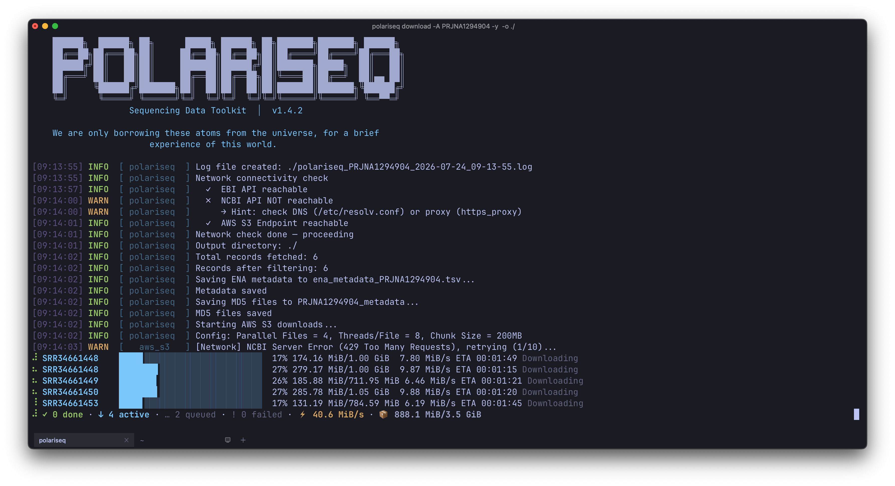

[中文文档](./docs/README_zh.md) | English

# EBIDownload

EBIDownload is a Rust-based toolkit for efficiently downloading and uploading sequencing data from the European Bioinformatics Institute (EBI) and NCBI SRA. It provides both a **command-line interface (CLI)** and a **cross-platform desktop GUI** (powered by Tauri), making it accessible to both bioinformatics engineers and wet-lab researchers.

By default, EBIDownload utilizes **AWS S3 global acceleration** to achieve ultra-fast download speeds (comparable to IDM/Aspera). **It is capable of downloading 2TB of data from the SRA database to local storage within 24 hours**, while providing full support for **resumable downloads** and **MD5 integrity verification**. It also employs [pigz](https://zlib.net/pigz/) for parallel decompression, significantly improving data acquisition efficiency.

In addition, EBIDownload supports **Aspera CLI (`ascp`)** as an alternative high-speed download method, which can be selected via the `-d ascp` flag (CLI) or the download method dropdown (GUI). To use this fallback, you must configure the Aspera path and key in the `EBIDownload.yaml` file (see [Configuration File](#4-configuration-file)).



## Features

- **Dual Interface (CLI + GUI)**: Choose between a powerful command-line tool for scripting and automation, or an intuitive desktop GUI (Windows/macOS/Linux) for visual operation.
- **AWS S3 Acceleration (Most Recommended)**: Direct multi-threaded downloading from NCBI SRA AWS S3 buckets, maximizing bandwidth utilization for global high-speed access. This is the fastest and most reliable method for large-scale data acquisition.
- **Aspera Fallback (Alternative)**: Integrates Aspera CLI (`ascp`) as an alternative high-speed channel when AWS S3 is unavailable or not preferred.
- **Parallel Processing**: Supports multi-threaded downloading and decompression.
- **Easy Configuration**: Manages software paths and keys through a simple YAML file. The GUI provides a visual settings panel for path configuration.
- **Flexible Usage**: Supports direct downloads via project accession numbers or TSV file lists.
- **Resumable Downloads**: Supports resumable downloads in `aws`, `ascp` and `prefetch` modes, ensuring download continuity.
- **Smart Auto-Fallback**: Automatically attempts AWS S3 first and seamlessly switches to Prefetch if the AWS download fails (Mode: `auto`).
- **Advanced Filtering**: Supports Regex-based filtering to precisely include or exclude specific samples or runs.
- **Real-time Progress (GUI)**: Visual progress bars, download queue management, and live log streaming in the desktop application.

---

## 1. Prerequisites and Setup

**Why are external dependencies required?**
Since the raw data downloaded from NCBI/EBI is typically in `.sra` format, it must be converted to standard `.fastq` format and compressed. Because there are currently no mature native Rust libraries available for parsing `.sra` files, this tool relies on external third-party command-line tools to handle these steps. Therefore, you must install the following dependencies before using the tool:

- **`sra-tools` (`prefetch` / `fasterq-dump`)**: Required. `prefetch` is used to download SRA data via standard NCBI protocols. `fasterq-dump` is used to extract and convert `.sra` files into `.fastq` format.
- **`pigz`**: Required. A parallel implementation of gzip used to quickly compress massive `.fastq` files into `.fastq.gz`, significantly saving storage space.
- **`aspera-cli` (`ascp`)**: Optional. A high-speed data transfer client by IBM, used as an alternative to traditional FTP/HTTP downloads.

### a. Conda Environment

We recommend using Conda to create an isolated runtime environment to easily install `sra-tools` and `aspera-cli`.

```bash
# Create and activate the conda environment using the provided .yaml file
conda env create -f ./docs/EBIDownload_env.yaml
conda activate EBIDownload_env
```

### b. Install pigz

`pigz` is a parallel implementation of `gzip` that can significantly speed up file compression.

- **For Ubuntu/Debian systems:**
  ```bash
  sudo apt-get update
  sudo apt-get install pigz
  ```

- **For macOS systems (using Homebrew):**
  ```bash
  brew install pigz
  ```

---

## 2. Project Structure

This project is organized as a Rust workspace with three crates:

```
crates/
├── ebidownload-core/     # Shared library: download/upload logic + data types
├── ebidownload-cli/      # Command-line tool
└── ebidownload-gui/      # Tauri desktop application (Rust backend + React frontend)
```

The **core** crate contains all shared business logic (AWS S3, FTP, Aspera, Prefetch, S3 Upload). Both CLI and GUI depend on it, ensuring consistent behavior across interfaces.

---

## 3. Building the Program

### Prerequisites

- [Rust](https://www.rust-lang.org/tools/install) toolchain
- [Node.js](https://nodejs.org/) 18+ (only for GUI build)
- External tools: `sra-tools`, `pigz` (see [Prerequisites and Setup](#1-prerequisites-and-setup))

### a. Build CLI Only

```bash
# Build CLI for development
CC=clang cargo build -p ebidownload-cli

# Build CLI for release
CC=clang cargo build -p ebidownload-cli --release

# Run CLI
./target/release/EBIDownload --help
```

### b. Build GUI (Desktop App)

Tauri **does not support cross-compilation**. You must build on the target platform:

| Target Platform | Build Host | Output Format |
|-----------------|------------|---------------|
| macOS | macOS (Intel or Apple Silicon) | `.dmg`, `.app` |
| Windows | Windows | `.msi`, `.exe` |
| Linux | Linux | `.AppImage`, `.deb` |

#### macOS

```bash
# 1. Install system dependencies
xcode-select --install
brew install pigz sra-tools

# 2. Build
cd crates/ebidownload-gui
npm install
npm run tauri build

# 3. Output
#   Intel Mac:    src-tauri/target/release/bundle/dmg/EBIDownload_1.3.7_x64.dmg
#   Apple Silicon: src-tauri/target/release/bundle/dmg/EBIDownload_1.3.7_aarch64.dmg
```

**Important**: Create `EBIDownload.yaml` with macOS paths before running:

```yaml
# Apple Silicon Mac (M1/M2/M3)
software:
  prefetch: /opt/homebrew/bin/prefetch
  fasterq_dump: /opt/homebrew/bin/fasterq-dump
  ascp: /Applications/Aspera\ Connect.app/Contents/Resources/ascp
setting:
  openssh: /Applications/Aspera\ Connect.app/Contents/Resources/asperaweb_id_dsa.openssh
```

#### Windows

```powershell
# 1. Install dependencies
#    - Install pigz: download from https://zlib.net/pigz/ and add to PATH
#    - Install sra-tools: https://github.com/ncbi/sra-tools/wiki/02.-Installing-SRA-Toolkit

# 2. Build (in PowerShell or CMD)
cd crates\ebidownload-gui
npm install
npm run tauri build

# 3. Output
#    src-tauri\target\release\bundle\msi\EBIDownload_1.3.7_x64_en-US.msi
#    src-tauri\target\release\bundle\nsis\EBIDownload_1.3.7_x64-setup.exe
```

**Note**: Windows may show a SmartScreen warning on first run because the binary is not code-signed. This is expected for unsigned applications.

#### Linux

```bash
# 1. Install dependencies (Ubuntu/Debian example)
sudo apt-get update
sudo apt-get install libwebkit2gtk-4.1-dev libappindicator3-dev librsvg2-dev patchelf
sudo apt-get install pigz sra-tools

# 2. Build
cd crates/ebidownload-gui
npm install
npm run tauri build

# 3. Output
#    src-tauri/target/release/bundle/appimage/ebidownload_1.3.7_amd64.AppImage
#    src-tauri/target/release/bundle/deb/ebidownload_1.3.7_amd64.deb
```

### c. CI/CD Automatic Multi-Platform Build

To build for all three platforms automatically, use GitHub Actions. See [`.github/workflows/build.yml`](./.github/workflows/build.yml) for a ready-to-use workflow that produces `.dmg`, `.msi`, and `.AppImage` on every release.

```yaml
# .github/workflows/build.yml (example)
name: Release Build
on:
  push:
    tags: [ 'v*' ]
jobs:
  build:
    strategy:
      matrix:
        platform: [macos-latest, ubuntu-latest, windows-latest]
    runs-on: ${{ matrix.platform }}
    steps:
      - uses: actions/checkout@v4
      - uses: dtolnay/rust-action@stable
      - uses: actions/setup-node@v4
        with:
          node-version: 20
      - run: cd crates/ebidownload-gui && npm install && npm run tauri build
      - uses: actions/upload-artifact@v4
        with:
          name: bundle-${{ matrix.platform }}
          path: crates/ebidownload-gui/src-tauri/target/release/bundle/*
```

---

## 4. Configuration File

This program uses a YAML file (defaulting to `EBIDownload.yaml`) to configure the paths for external tools, including the Aspera CLI (`ascp`) and `sra-tools` (`prefetch`, `fasterq-dump`).

You need to **manually create** this file and fill in the correct absolute paths according to your system environment. Even if you primarily use the default **AWS S3** mode, it is recommended to configure the Aspera path and key so that the `ascp` fallback is ready when needed.

Below is the standard format for the `EBIDownload.yaml` file:

```yaml
# EBIDownload Setting yaml
software:
  ascp: /path/to/your/ascp
  prefetch: /path/to/your/prefetch
  fasterq_dump: /path/to/your/fasterq-dump
setting:
  openssh: /path/to/your/asperaweb_id_dsa.openssh
```

**Important Notes**:
- The `software` section must point to the absolute paths of the `ascp`, `prefetch`, and `fasterq-dump` executables.
- The `openssh` key in the `setting` section must point to the absolute path of the key file provided by Aspera Connect (`asperaweb_id_dsa.openssh`). This is required when using the Aspera (`ascp`) download mode.
- Ensure all paths are correct, or the program will not run properly in the corresponding download mode.

---

## 5. Usage

### GUI (Desktop Application)

The GUI provides an intuitive interface for users who prefer visual operation over command-line tools.

```bash
cd crates/ebidownload-gui
npm run tauri dev
```

**Interface Overview:**

| Tab | Function |
|-----|----------|
| **Download** | Enter Accession ID, select output directory, choose download method (AWS/Aspera/FTP/Prefetch/Auto), set parallel threads, and start downloading. Supports fetching metadata preview before download. |
| **Upload** | Select files, enter S3 bucket name, configure upload settings, and submit to NCBI SRA via AWS S3. |
| **Settings** | Visually configure paths for `ascp`, `prefetch`, `fasterq-dump`, and Aspera OpenSSH key. |

**Features:**
- Real-time download progress bars for each run
- Live log panel showing download/conversion/compression status
- Dry-run mode to preview what would be downloaded
- Support for TSV file input (batch download)

---

### CLI (Command-Line Tool)

#### a. Command-Line Arguments

```
./target/release/EBIDownload -h
```

| Short | Long             | Description                                      | Default      |
|-------|------------------|--------------------------------------------------|--------------|
| `-A`  | `--accession`    | Download by project Accession ID                 |              |
| `-T`  | `--tsv`          | Download using a TSV file containing Accession IDs |              |
| `-o`  | `--output`       | **Required**, the output directory for downloaded files |              |
| `-p`  | `--multithreads` | Number of files to download in parallel          | 4            |
| `-d`  | `--download`     | Download method (`aws`, `ascp`, `ftp`, `prefetch`, `auto`) | `aws`        |
| `-y`  | `--yaml`         | Specify the path to the `EBIDownload.yaml` config file | `EBIDownload.yaml` |
|       | `--log-level`    | Log level (`debug`, `info`, `warn`, `error`)     | `info`       |
|       | `--log-format`   | Log output format (`text`, `json`)               | `text`       |
| `-t`  | `--aws-threads`  | **AWS/Prefetch**: Threads for internal chunk download or conversion per file | 8            |
|       | `--chunk-size`   | **AWS Only**: Chunk size in MB                   | 20           |
|       | `--max-size`     | **Prefetch Only**: Max download size limit (e.g., `100G`) | `100G`       |
|       | `--pe-only`      | Only download Paired-End data, ignore Single-End | `false`      |
|       | `--filter-sample`| Regex pattern to include samples matching this   |              |
|       | `--filter-run`   | Regex pattern to include runs matching this      |              |
|       | `--exclude-sample`| Regex pattern to exclude samples matching this   |              |
|       | `--exclude-run`  | Regex pattern to exclude runs matching this      |              |
|       | `--cleanup-sra`  | Remove intermediate .sra files after conversion | `false`      |
|       | `--dry-run`      | Show what would be downloaded without actually downloading | `false` |
| `-h`  | `--help`         | Print help information                           |              |
| `-V`  | `--version`      | Print version information                        |              |

**Note**: The `-A` and `-T` options are typically mutually exclusive and are used to specify the data source to download.

#### b. Example

**1. AWS S3 High-Speed Mode (Most Recommended)**

This mode uses AWS S3 buckets for global acceleration, similar to IDM. It is the best choice for large-scale data acquisition.

```bash
# Download using AWS S3 with 8 threads per file, processing 4 files in parallel
./target/release/EBIDownload -A PRJNA1251654 -o ./data -d aws -p 4 -t 8
```

**2. Filtering Mode**

You can use `--filter-run` or `--filter-sample` to download specific data.

```bash
# Download a specific Run from a project
./target/release/EBIDownload -A PRJNA833659 -o ./ -p 6 -d aws -y ./EBIDownload.yaml --chunk-size 200 --filter-run SRR19019104

# Download multiple specified Runs (separated by spaces)
./target/release/EBIDownload -A PRJNA833659 -o ./ -p 6 -d aws --filter-run SRR19019104 SRR19019105

# Download a list of specific Runs from a project (useful for targeted re-analysis)
./target/release/EBIDownload -A PRJNA259308 -o ./ -p 6 -d aws \
  -y ./EBIDownload.yaml \
  --chunk-size 200 \
  --filter-run SRR1572540 SRR1572541 SRR1572542 
```

**3. Standard Mode (Prefetch)**

The following example demonstrates how to download data for project `PRJNA1251654`, using 6 threads, and saving the files to the current directory.

```bash
# Make sure you have activated the conda environment and the config file is set up correctly
# conda activate EBIDownload_env

# Example command:
./target/release/EBIDownload -A PRJNA1251654 -o ./ --multithreads 6 --yaml ./EBIDownload.yaml -d prefetch
```

---

## Important Notes on AWS S3 High-Speed Download Mode

This tool leverages the AWS S3 open data pool (`s3://sra-pub-run-odp/`) for high-speed downloads, which is only applicable to data that has already been archived in SRA. Due to the inherent timing of NCBI data processing workflows, the following important limitations apply:

1. **Data Availability Delay**
   GEO metadata release (obtaining GSE/GSM IDs) ≠ SRA data availability.
   Raw sequencing data must undergo quality control, format conversion, and indexing before it is transferred from GEO to SRA and synchronized to AWS S3. This process usually takes **1–4 weeks**.
   During this period, even if the GEO page is public, the S3 path may not yet exist, and the tool will return a 404 error.

2. **How to Check if Data is Ready**
   Before downloading, please confirm:
   - The GEO page shows an "SRA Run Selector" link (rather than "Data coming soon").
   - Or verify via the command line: `esearch -db sra -query "GSEXXXXXX" | efetch -format runinfo` returns a list of SRR accessions.

3. **Alternatives for Data Not Yet in SRA**
   If the data has not yet entered SRA:
   - **Use SRA Toolkit**: Submit a download request with the `prefetch` command; the system will automatically fetch the data once it becomes available (may require queuing).
   - **Contact the original authors**: The GEO page provides contact information for the corresponding authors, who can usually provide a direct download link (FTP, Google Drive, etc.) within 24–48 hours.
   - **Check the ENA mirror**: The European Nucleotide Archive (ENA) is sometimes available 1–3 days earlier than SRA. Try `ftp://ftp.sra.ebi.ac.uk/`.

4. **Recommended Download Strategy**
   We recommend implementing a tiered download logic: first check SRA availability; if ready, use this tool for high-speed S3 downloads; if not ready, automatically fall back to SRA Toolkit or prompt the user to wait/contact the authors.

> **Note**: This limitation stems from the NCBI data archiving architecture, not a technical defect of this tool. For urgent needs, we recommend contacting the data submitter to obtain the original files directly.

---
## 6. Output Structure

After the script runs, the output directory will contain the following files and directories:

```
.
├── EBIDownload_{ACCESSION}_YYYY-MM-DD_HH-MM-SS.log
├── ena_metadata_{ACCESSION}.tsv
├── R1_fastq_md5_{ACCESSION}.tsv
├── R2_fastq_md5_{ACCESSION}.tsv
├── SRRXXXXXX/
│   └── ... (downloaded files)
└── ...
```

- **Log File**: `EBIDownload_{ACCESSION}_YYYY-MM-DD_HH-MM-SS.log`
  - Records the detailed execution log of the script, with the Accession ID in the filename for easy identification.

- **Metadata File**: `ena_metadata_{ACCESSION}.tsv`
  - Contains all fetched and filtered metadata from the EBI API, with a header comment indicating the source project.

- **MD5 Checksum Files**: `R1_fastq_md5_{ACCESSION}.tsv` and `R2_fastq_md5_{ACCESSION}.tsv`
  - These files contain the official MD5 checksums and sample names retrieved from the EBI database for the downloaded FASTQ files (R1 and R2 reads, respectively). You can use these files to verify the integrity of your downloaded data.

- **Sample Directories**: `SRRXXXXXX/`
  - Each directory corresponds to a downloaded sample (Run ID) and contains the actual sequencing data files.

---

## 7. Upload to NCBI SRA via AWS S3

In addition to downloading, EBIDownload supports **uploading sequencing data to AWS S3** for fast NCBI SRA submission. This is useful when you need to submit large volumes of data (hundreds of GB to TB scale) and want to leverage AWS's enterprise-grade bandwidth for reliable, high-speed uploads.

### a. Prerequisites

- **Your own AWS S3 Bucket**: You must create an S3 bucket **in the `us-east-1` (US East - N. Virginia) region**. This is a [hard requirement from NCBI](https://www.ncbi.nlm.nih.gov/sra/docs/data-delivery) — buckets in other regions will not work.
- **AWS Credentials**: Configure your AWS credentials via `aws configure` or environment variables (`AWS_ACCESS_KEY_ID`, `AWS_SECRET_ACCESS_KEY`). These are used locally and are **never shared with NCBI**.

### b. How It Works

The S3-based SRA submission uses a **read-only permission model** — you don't give NCBI any credentials:

1. **Upload files** to your S3 bucket using your own AWS key (handled by `EBIDownload upload`)
2. **Apply Bucket Policy** to authorize NCBI's IAM user (`arn:aws:iam::228184908524:user/SA-SubmissionPortal-S3`) with read-only access (handled by `--apply-policy`)
3. **Submit on the SRA Portal** ([https://submit.ncbi.nlm.nih.gov/subs/sra/](https://submit.ncbi.nlm.nih.gov/subs/sra/)), select "Upload from Amazon S3 storage" and provide your S3 paths

```
You (Bucket Owner)                    NCBI SRA Portal
       │                                    │
       │  1. Upload files (your AWS key)     │
       │  ──────────────────► S3 Bucket      │
       │                                    │
       │  2. Add Bucket Policy               │
       │     (read-only for NCBI IAM user)   │
       │  ──────────────────► S3 Bucket      │
       │                                    │
       │  3. Submit S3 paths on Portal       │
       │  ──────────────────────────────────►│
       │                                    │
       │              NCBI reads files       │
       │              (their own IAM key)    ├────► S3 Bucket (read-only)
```

### c. Cost

| Item | Cost |
|------|------|
| S3 Storage | ~$0.023/GB/month |
| Upload traffic (into AWS) | **Free** |
| NCBI reading traffic (same region) | **Free** |

The actual cost is **storage only**. For example, 100 GB of data stored for 2 weeks costs less than **$1**. Once SRA confirms your submission has been processed, you can **delete the bucket** to stop all charges. AWS Free Tier also includes 5 GB of S3 storage for the first 12 months.

### d. Usage

```bash
# Basic upload to S3
EBIDownload upload -b my-sra-bucket -f sample_R1.fastq.gz sample_R2.fastq.gz

# Upload with NCBI Bucket Policy + metadata template generation
EBIDownload upload -b my-sra-bucket \
    -f sample_R1.fastq.gz sample_R2.fastq.gz \
    --apply-policy \
    --metadata-template sra_metadata.tsv

# Dry run: preview files without uploading
EBIDownload upload -b my-sra-bucket -f *.fastq.gz --dry-run

# Upload with S3 key prefix (subdirectory)
EBIDownload upload -b my-sra-bucket --prefix project_001 -f *.fastq.gz
```

| Option | Description | Default |
|--------|-------------|---------|
| `-b`, `--bucket` | **Required**, AWS S3 bucket name | — |
| `--prefix` | S3 key prefix (subdirectory) | — |
| `-f`, `--files` | Files to upload | — |
| `--region` | AWS region (must be `us-east-1` for NCBI) | `us-east-1` |
| `-c`, `--concurrent` | Concurrent file uploads | 4 |
| `--apply-policy` | Apply NCBI SRA submission bucket policy | `false` |
| `--metadata-template` | Generate SRA metadata template TSV | — |
| `--dry-run` | Show what would be uploaded without uploading | `false` |

### e. When to Use S3 Upload vs. Alternatives

| Method | Cost | Speed | Best For |
|--------|------|-------|----------|
| **S3 Upload** (`EBIDownload upload`) | ~$0.023/GB/month | Fastest, most reliable | Large datasets (100 GB+), unstable networks |
| **Aspera (ascp)** | Free | Fast | Medium datasets, good network |
| **NCBI Web Upload** | Free | Slow, unreliable for large files | Small datasets (< 10 GB) |

> **Tip**: If your data is small, use the free NCBI Web Upload or Aspera. S3 upload is a "pay a little for speed and reliability" option — ideal when you have hundreds of GB to submit and want enterprise-grade bandwidth with resumable transfers.

### f. Complete Workflow Example

```bash
# Step 1: Create an S3 bucket in us-east-1 (one-time setup)
aws s3 mb s3://my-sra-bucket --region us-east-1

# Step 2: Upload files + apply NCBI policy + generate metadata template
EBIDownload upload -b my-sra-bucket \
    -f sample1_R1.fastq.gz sample1_R2.fastq.gz \
       sample2_R1.fastq.gz sample2_R2.fastq.gz \
    --apply-policy \
    --metadata-template sra_metadata.tsv \
    --region us-east-1

# Step 3: Fill in the empty columns in sra_metadata.tsv
#   (library_strategy, library_source, platform, instrument_model, etc.)

# Step 4: Go to https://submit.ncbi.nlm.nih.gov/subs/sra/
#   - Create a new submission
#   - At the "Files" step, select "Upload from Amazon S3 storage"
#   - Enter your S3 paths: s3://my-sra-bucket/sample1_R1.fastq.gz etc.

# Step 5: Wait for SRA confirmation email, then delete the bucket
aws s3 rb s3://my-sra-bucket --force
```
